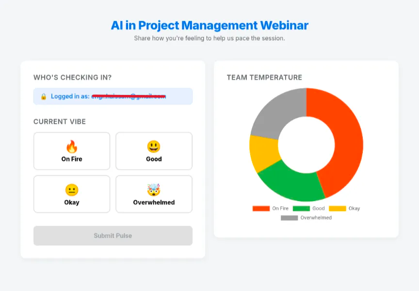

# Webinar Ice Breaker 

A real-time interactivity tool for webinars. This Google Apps Script web app allows attendees to share their current "vibe" (On Fire, Good, Okay, Overwhelmed) and visualize the collective team temperature in a live-updating donut chart.

## 🚀 Features

* **Dynamic Branding:** The webinar title is controlled via a Google Sheet cell—update it instantly without touching the code.
* **Smart User Detection:**
    * **Auto-Login:** Automatically detects the email of logged-in users.
    * **Guest Support:** If a user's email cannot be detected (depending on deployment), a manual "Name" input field automatically appears.
* **Real-Time Data:** The chart auto-refreshes every 5 seconds to keep the audience engaged.
* **Crash Prevention:** Includes error handling to prevent the "spinning wheel" if the database connection fails.

## 🛠️ Prerequisites

1.  A **Google Account** (to host the script and sheet).
2.  A **Google Sheet** to act as the database.

## ⚙️ Installation & Setup

### Phase 1: Google Sheet Setup
1.  Create a new Google Sheet.
2.  **Tab 1 (Database):**
    * Rename the tab at the bottom to `Data` (Case sensitive!).
    * Add headers in Row 1: `Timestamp`, `Name`, `Vibe`.
3.  **Tab 2 (Configuration):**
    * Create a new tab and rename it `Config` (Case sensitive!).
    * In cell **A1**, type your webinar title (e.g., "Q1 Town Hall" or "Project Kickoff"). This will appear at the top of the app.

### Phase 2: Code Installation
1.  Open your Google Sheet and go to **Extensions > Apps Script**.
2.  **Backend:**
    * Open `Code.gs`.
    * Copy the content from `Code.js` in this repo and paste it there.
3.  **Frontend:**
    * Click the **+** (Plus) icon next to "Files" and select **HTML**.
    * Name the file `Index`.
    * Copy the content from `Index.html` in this repo and paste it there.

### Phase 3: Deployment (Critical)
To make the app accessible to your attendees:

1.  In the Apps Script editor, click the blue **Deploy** button > **New deployment**.
2.  **Select type:** Web app.
3.  **Description:** e.g., "Pulse Checker v1".
4.  **Execute as:** `Me` (your email).
    * *This ensures the script has permission to write to your sheet.*
5.  **Who has access:** `Anyone with a Google Account`.
    * *Setting explanation:* Users will be prompted to sign in with Google. The app will automatically capture their email and hide the manual name input box.
    * *Alternative:* If you select `Anyone`, the app becomes public. No login is required, but the app will not capture emails automatically; it will show the manual name input box instead.
6.  Click **Deploy**.
7.  Copy the **Web App URL** and share it in your webinar chat.

## 📊 Usage Guide

* **Changing the Title:** Simply update cell **A1** in the `Config` tab of your Google Sheet. Refresh the web app to see the change.
* **Resetting Data:** To start fresh for a new webinar, simply delete all rows in the `Data` tab (except the header row).
* **Viewing Results:** You can view the raw data in the Google Sheet or watch the live chart on the web app.

## 📂 File Structure

* `Code.js` - Server-side logic (handles database writing and user session).
* `Index.html` - Client-side interface (HTML/CSS) and chart logic (Chart.js).

---
*Built with Google Apps Script & Chart.js*
